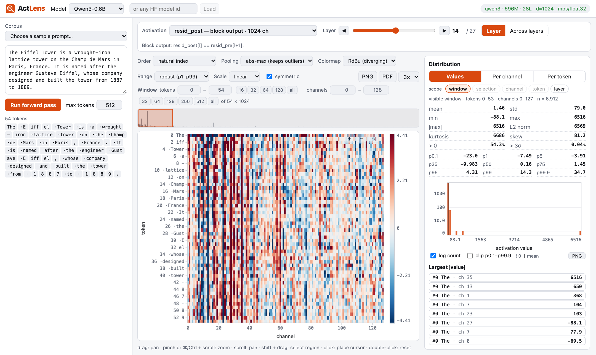
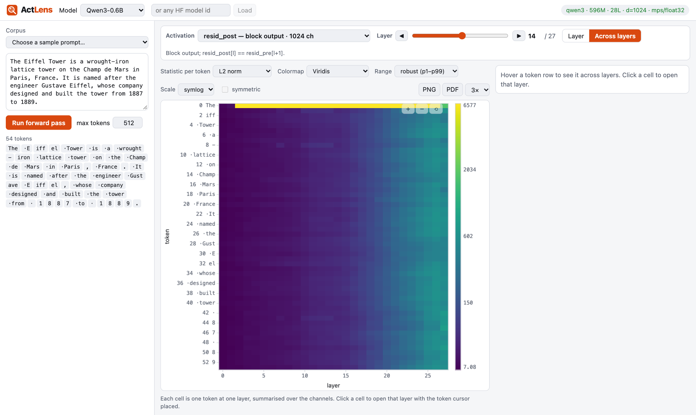
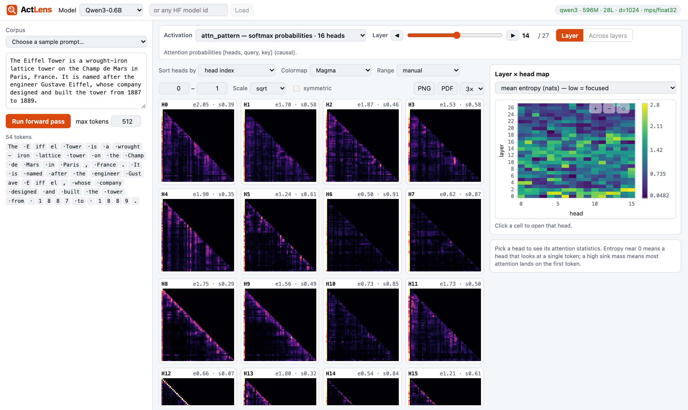

# Examples

Three things you can see in a few clicks. All screenshots use `Qwen/Qwen3-0.6B` and the sample prompt *Eiffel Tower*
from the corpus menu.

## 1. A massive activation on the first token

Pick `resid_post`, then open the **Distribution** panel (scope: *layer*). At layer 14, one channel of token 0 (`The`) is
about 6500 while the typical value is around 1, so the histogram needs a log axis and the heatmap needs a robust range
(the default, p1–p99) to show anything else.

Switch to **Across layers** to see the same effect for every layer at once: the first token's L2 norm is far above all
others from the first layers onward.

Click any cell to open that layer with the token cursor placed.

## 2. Attention heads at a glance

Pick `attn_pattern`. The grid shows every head of the layer, labelled with its entropy (`e`) and the attention mass on
the first token (`s`, the "sink"). Heads with `s` near 1 (H6, H10, H14 below) mostly park attention on token 0; H12's
bright diagonal is a previous-token head. The **Layer × head map** on the right shows entropy, sink mass or attention
distance for every layer and head, and clicking a cell jumps to that head.

## 3. Look inside one head

For `q`, `k`, `v`, `q_rope`, `k_rope` and `attn_ctx` the channel axis is `head × head_dim`. Use the **Head** control to
jump the window to one head, or drag with Shift held to select a region and read its statistics in the Distribution
panel. **Per channel** ranks outlier channels by |max|, std or |mean|, with a clickable list of the top outliers.
